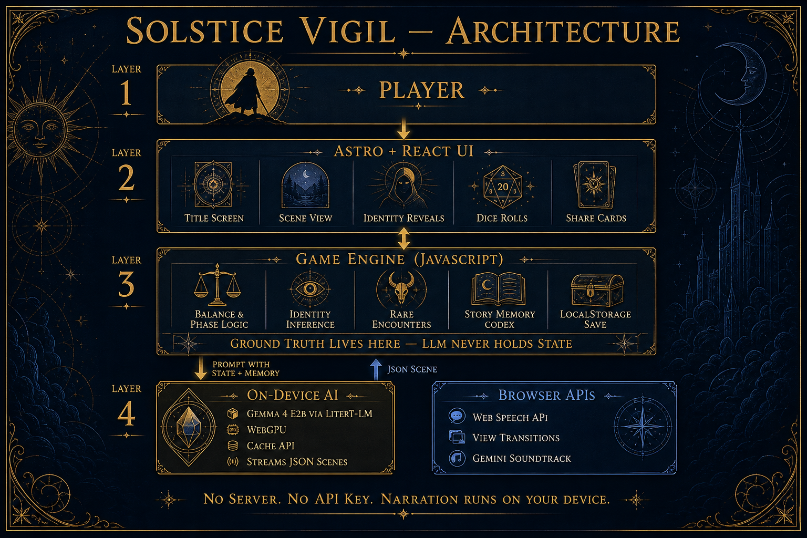

# SOLSTICE VIGIL

A solo narrative RPG about holding the balance between the Long Day and the Hush of Night. At the June solstice, the sun stopped setting — you are the wanderer trying to keep day and night from tipping over completely.

**[Play it →](https://solstice-vigil.vercel.app/)**

Built for the [DEV June Solstice Game Jam](https://dev.to/challenges/june-game-jam-2026-06-03). See [`challenge.md`](challenge.md) for the full submission write-up.

## What you do

- **Balance day and night.** Every choice moves a meter between Long Day and the Hush of Night. Lean too far and the vigil ends — you share how many days you held the wheel.
- **Get scenes narrated on-device.** Gemma 4 (E2B) runs in Chrome via Google AI Edge LiteRT-LM and WebGPU. No server, no API key, nothing leaves the machine.
- **Earn identities.** Titles like *Ember Saint* or *Moon Herald* emerge from your choices, not a character sheet.
- **Find rare encounters.** Fifteen wonders with a codex, eligibility rules, and share cards.
- **Roll a d20** on bold choices. Sometimes the solstice pushes back.
- **Optional speech narration** ducks the soundtrack while a scene is read aloud.

**Demo mode** skips the ~2 GB model download and plays the full loop with hand-written scenes. Use the title-screen button, `?demo=1`, or the link on the loading screen.

## Architecture

JavaScript owns game state — balance, endings, identities, encounters, dice. Gemma gets structured context and returns JSON. It narrates; it does not decide outcomes.



## Tech stack

- **Astro 5 + React 19** — static shell, React island for the game
- **Tailwind CSS 4** — manuscript UI, `border-shape` frames, View Transitions
- **Gemma 4 (E2B)** via `@litert-lm/core` (CDN) + WebGPU — on-device scene generation
- **Web Speech API** — optional narration
- **localStorage** — save state; **Cache API** — model blob
- **Playwright** — unit + E2E tests (demo mode for CI)

The original Zo prototype lives in [`prototype/`](prototype/) for reference.

## Getting started

Requires **Node.js 18+** and **Chrome** (for the live Gemma path).

```bash
npm install
npm run dev        # http://127.0.0.1:4321
npm run build
npm run preview
```

Open with `?demo=1` if you do not want to download the model:

```
http://127.0.0.1:4321/?demo=1
```

### Tests

```bash
npm test              # unit + e2e
npm run test:unit
npm run test:e2e
npm run test:e2e:ui
```

See [`tests/README.md`](tests/README.md) for targeting other servers and query params used in CI.

## Project layout

```
.
├── src/
│   ├── components/game/   # SolsticeVigil game loop + UI
│   ├── lib/               # prompt, identity, encounters, dice, story memory
│   ├── data/              # identity and encounter definitions
│   ├── hooks/             # audio and speech narration
│   └── pages/index.astro  # Astro entry
├── tests/                 # Playwright unit + e2e
├── demo-final/            # automated demo capture + render scripts
├── docs/                  # PRD, design notes, architecture
├── prototype/             # frozen first playable (Zo Site)
└── challenge.md           # jam submission narrative
```

## Where to read the code

| Area | Files |
| --- | --- |
| Game loop, LLM, UI states | `src/components/game/SolsticeVigil.tsx` |
| Narrator prompt + turn context | `src/lib/prompt.ts` |
| Wanderer titles | `src/lib/identity.ts`, `src/data/identities.ts` |
| Rare wonders | `src/lib/encounters.ts`, `src/data/encounters.ts` |
| d20 resolution | `src/lib/dice.ts` |
| Story memory for long runs | `src/lib/story-memory.ts` |

## Demo videos

Automated capture and render pipeline:

```bash
npm run demo:final              # desktop: capture + render
npm run demo:final:mobile       # mobile viewport
```

Outputs: `demo-final/solstice-vigil-demo-final.mp4` and `demo-final/solstice-vigil-demo-final-mobile.mp4`.

## Docs

- [`docs/prd.md`](docs/prd.md) — product direction and creative north star
- [`docs/design.md`](docs/design.md) — visual and UX spec
- [`docs/improvements.md`](docs/improvements.md) — follow-up ideas

## License

[MIT](LICENSE)

---

The wheel turns.
